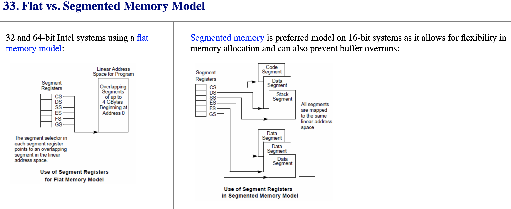

# 寄存器简介
## IA32 寄存器
IA32寄存器通常包含**8个通用寄存器**，**6个段寄存器**，**1个EFLAGES寄存器**，**1个EIP寄存器**，**4个控制寄存器**，**3个*TR寄存器**,**1个TR寄存器**

### 通用寄存器
通用寄存器一般用途有三类
- 存放算数和逻辑操作的操作数
- 存放地址操作的操作数
- 存放内存指针
  
|名称| 简介| 备注|
| --| -- | -- |
|EAX| 一般作为累加器(add)|还多用于函数返回值中，用于保存返回值、操作数存储 |
|EBX| 一般作为基地址寄存器(base)|指向DS数据段中数据的指针 |
|ECX| 一般作为计数寄存器(count)|字符串和循环操作的计数器|
|EDX| 一般用来存放数据(data)| I/O指针|
|ESP| 一般作为栈指针寄存器(stack pointer)|栈指针（在SS段中）|
|EBP| 一般作为基指针寄存器(base pointer)|指向栈中的数据（SS段中），一般用作函数嵌套调用时的栈帧基址|
|ESI| 一般作为源变址寄存器(source index)|指向DS数据段中数据的指针；字符串操作的源指针|
|EDI| 一般作为目标变址寄存器(destinatin index)|跟ES配合，指向目的数据的指针；字符串操作的目的指针

### 段寄存器
在操作系统中，一般将内存地址空间分为7个区域，如进程地址空间所示

#### 进程地址空间
低地址 addr

|代码段 .text .init .rodata|
|--------|
|读写数据段 .data .bss|
|堆 heap  地址增长方向 ↓ |
| |
|动态库加载区|
| |
|栈 stack 地址增长方向 ↑|
| |
|内核地址空间|

高地址 addr

#### 段
包含4个段，代码段，数据段（只读数据段，读写数据段），堆段，栈段

| 段 | 备注|
|--|--|
|代码段|CS .init .text .rodata, 存放程序可执行代码的区域，字符串常量也在这个段，一般**只读**，**某些**架构也支持**可写**，程序运行前大小即可确定|
|数据段|DS  .data .bss存放数据，全局变量的区域|
|堆段|动态分配的内存段，如malloc calloc new 等系统调用申请分配的区域，大小不固定|
|栈段|SS 堆是用于存放进程运行中被动态分配的内存段，如程序运行中的临时变量，存放函数调用顺序等，它的大小并不固定，

#### .init .text .rodata等的解释
|段|备注 |
|--|--|
|.init|.init 段是一段属于共享对象的代码，装入共享对象时该代码将执行。 |
|.text| code segment / text segment，存放程序执行代码的一块内存区域， 一些常量也在这个区域|
|.rodata| 字符串常量区，共享区域，const修饰的全局变量 |
|.data| 已经初始化的全局变量 | 
|.bss| 未初始化的全局变量和已经初始化为0的全局变量|

#### 内存模型

图片引用自[c-jump.com]

[c-jump.com]: http://www.c-jump.com/CIS77/ASM/Memory/M77_0330_flat_vs_segmented.htm "内存模型"