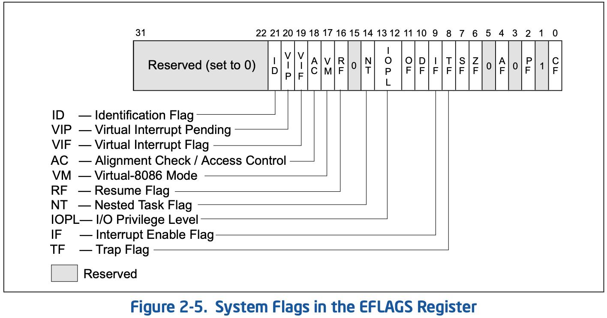
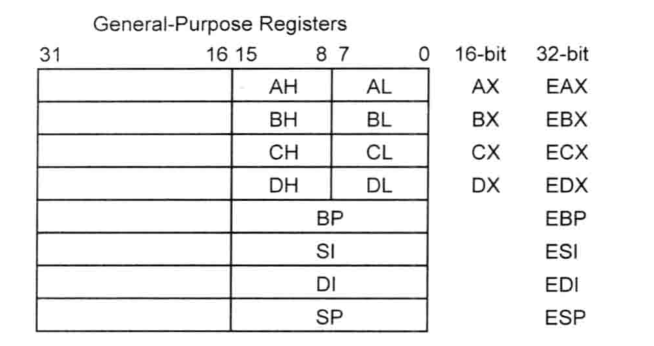

# 寄存器

## IA32 寄存器
IA32寄存器通常包含**8个通用寄存器**，**6个段寄存器**，**1个EFLAGES寄存器**，**1个EIP寄存器**，**4个控制寄存器**，**3个*TR寄存器**,**1个TR寄存器**

### 通用寄存器
通用寄存器一般用途有三类
- 存放算数和逻辑操作的操作数
- 存放地址操作的操作数
- 存放内存指针
  
|名称| 简介| 备注|
| --| -- | -- |
|EAX| 一般作为累加器(add)|还多用于函数返回值中，用于保存返回值、操作数存储 |
|EBX| 一般作为基地址寄存器(base)|指向DS数据段中数据的指针 |
|ECX| 一般作为计数寄存器(count)|字符串和循环操作的计数器|
|EDX| 一般用来存放数据(data)| I/O指针|
|ESP| 一般作为栈指针寄存器(stack pointer)|栈指针（在SS段中）|
|EBP| 一般作为基指针寄存器(base pointer)|指向栈中的数据（SS段中），一般用作函数嵌套调用时的栈帧基址|
|ESI| 一般作为源变址寄存器(source index)|指向DS数据段中数据的指针；字符串操作的源指针|
|EDI| 一般作为目标变址寄存器(destinatin index)|跟ES配合，指向目的数据的指针；字符串操作的目的指针

### 段寄存器
在操作系统中，一般将内存地址空间分为7个区域，如进程地址空间所示

#### 进程地址空间
低地址 addr

|代码段 .text .init .rodata|
|--------|
|读写数据段 .data .bss|
|堆 heap  地址增长方向 ↓ |
| |
|动态库加载区|
| |
|栈 stack 地址增长方向 ↑|
| |
|内核地址空间|

高地址 addr

#### 段
包含4个段，代码段，数据段（只读数据段，读写数据段），堆段，栈段

| 段 | 备注|
|--|--|
|代码段|CS .init .text .rodata, 存放程序可执行代码的区域，字符串常量也在这个段，一般**只读**，**某些**架构也支持**可写**，程序运行前大小即可确定|
|数据段|DS  .data .bss存放数据，全局变量的区域|
|堆段|动态分配的内存段，如malloc calloc new 等系统调用申请分配的区域，大小不固定|
|栈段|SS 堆是用于存放进程运行中被动态分配的内存段，如程序运行中的临时变量，存放函数调用顺序等，它的大小并不固定，

#### .init .text .rodata等的解释
|段|备注 |
|--|--|
|.init|.init 段是一段属于共享对象的代码，装入共享对象时该代码将执行。 |
|.text| code segment / text segment，存放程序执行代码的一块内存区域， 一些常量也在这个区域|
|.rodata| 字符串常量区，共享区域，const修饰的全局变量 |
|.data| 已经初始化的全局变量 | 
|.bss| 未初始化的全局变量和已经初始化为0的全局变量|

在linux系统中，可以通过命令nm(names)来查看程序的段分布信息

#### 内存模型

图片引用自[c-jump.com]

### eflags 寄存器
用于标志运算，执行等的状态和标志

图片引用自[64-ia-32-architectures-software-developer-vol-3a-part-1-manual] 2-10 Vol. 3A 


### IA32与x86-64通用寄存器的关系
 引用自[generalRegister]  
 引用自[86_64GeneralRegister]


### 传参方式

#### testcode 
```cpp
int test(int a, int b, int c, int d, int e, int f, int g, int h)
{
	int res = a + b + c + d + e + f + g + h;
	return res;
}

int main()
{
	int p1 = 5, p2=6, p3 = 7, p4 = 8, p5=9, p6=10, p7=11, p8=12;
	int res = test(p1,p2,p3,p4,p5,p6,p7,p8);
    return 0;
}
```

#### x86
使用栈传递，从右往左入调用栈

#### X64
在X64下，是寄存器传参。 前6个参数分别是 rdi,rsi, rdx, rcx, r8d, r9d,进行传参，多余的通过调用栈传参。从右向左入栈。

```x86asm
Dump of assembler code for function main:
   0x000000000040060e <+0>:     push   %rbp
   0x000000000040060f <+1>:     mov    %rsp,%rbp
   0x0000000000400612 <+4>:     sub    $0x30,%rsp
   0x0000000000400616 <+8>:     movl   $0x5,-0x4(%rbp)   ;p1
   0x000000000040061d <+15>:    movl   $0x6,-0x8(%rbp)   ;p2
   0x0000000000400624 <+22>:    movl   $0x7,-0xc(%rbp)   ;p3
   0x000000000040062b <+29>:    movl   $0x8,-0x10(%rbp)  ;p4
   0x0000000000400632 <+36>:    movl   $0x9,-0x14(%rbp)  ;p5
   0x0000000000400639 <+43>:    movl   $0xa,-0x18(%rbp)  ;p6
   0x0000000000400640 <+50>:    movl   $0xb,-0x1c(%rbp)  ;p7
   0x0000000000400647 <+57>:    movl   $0xc,-0x20(%rbp)  ;p8
   0x000000000040064e <+64>:    mov    -0x18(%rbp),%r9d  ;p6
   0x0000000000400652 <+68>:    mov    -0x14(%rbp),%r8d  ;p5
   0x0000000000400656 <+72>:    mov    -0x10(%rbp),%ecx  ;p4
   0x0000000000400659 <+75>:    mov    -0xc(%rbp),%edx   ;p3
   0x000000000040065c <+78>:    mov    -0x8(%rbp),%esi   ;p2
   0x000000000040065f <+81>:    mov    -0x4(%rbp),%eax
   0x0000000000400662 <+84>:    mov    -0x20(%rbp),%edi
   0x0000000000400665 <+87>:    push   %rdi
   0x0000000000400666 <+88>:    mov    -0x1c(%rbp),%edi
   0x0000000000400669 <+91>:    push   %rdi
   0x000000000040066a <+92>:    mov    %eax,%edi         ;p1
   0x000000000040066c <+94>:    callq  0x4005c8 <_Z4testiiiiiiii>
   0x0000000000400671 <+99>:    add    $0x10,%rsp
   0x0000000000400675 <+103>:   mov    %eax,-0x24(%rbp)
   0x0000000000400678 <+106>:   mov    $0x0,%eax
   0x000000000040067d <+111>:   leaveq 
   0x000000000040067e <+112>:   retq   
End of assembler dump.
```

```x86asm
(gdb) disas test
Dump of assembler code for function _Z4testiiiiiiii:
   0x00000000004005c8 <+0>:     push   %rbp
   0x00000000004005c9 <+1>:     mov    %rsp,%rbp
   0x00000000004005cc <+4>:     mov    %edi,-0x14(%rbp)  ;p1
   0x00000000004005cf <+7>:     mov    %esi,-0x18(%rbp)  ;p2
   0x00000000004005d2 <+10>:    mov    %edx,-0x1c(%rbp)  ;p3
   0x00000000004005d5 <+13>:    mov    %ecx,-0x20(%rbp)  ;p4
   0x00000000004005d8 <+16>:    mov    %r8d,-0x24(%rbp)  ;p5
   0x00000000004005dc <+20>:    mov    %r9d,-0x28(%rbp)  ;p6
   0x00000000004005e0 <+24>:    mov    -0x14(%rbp),%edx  ;
   0x00000000004005e3 <+27>:    mov    -0x18(%rbp),%eax  ;
   0x00000000004005e6 <+30>:    add    %eax,%edx
   0x00000000004005e8 <+32>:    mov    -0x1c(%rbp),%eax
   0x00000000004005eb <+35>:    add    %eax,%edx
   0x00000000004005ed <+37>:    mov    -0x20(%rbp),%eax
   0x00000000004005f0 <+40>:    add    %eax,%edx
   0x00000000004005f2 <+42>:    mov    -0x24(%rbp),%eax
   0x00000000004005f5 <+45>:    add    %eax,%edx
   0x00000000004005f7 <+47>:    mov    -0x28(%rbp),%eax
   0x00000000004005fa <+50>:    add    %eax,%edx
   0x00000000004005fc <+52>:    mov    0x10(%rbp),%eax   ;
   0x00000000004005ff <+55>:    add    %eax,%edx
   0x0000000000400601 <+57>:    mov    0x18(%rbp),%eax
   0x0000000000400604 <+60>:    add    %edx,%eax
   0x0000000000400606 <+62>:    mov    %eax,-0x4(%rbp)
   0x0000000000400609 <+65>:    mov    -0x4(%rbp),%eax
   0x000000000040060c <+68>:    pop    %rbp
   0x000000000040060d <+69>:    retq   
End of assembler dump.
```

从上面的代码可以看出，call指令将函数的返回指令的地址压到的是test函数栈的


```cpp
int test(int a, int b, int c, int d, int e, int f, int g, int h, int i)
{
	int64_t res = a + b + c + d + e + f + g + h + i;
	return res;
}

int main()
{
	int p1 = 5, p2=6, p3 = 7, p4 = 8, p5=9, p6=10, p7=11, p8=12, p9 = 13;
	int res = test(p1,p2,p3,p4,p5,p6,p7,p8, p9);
	printf("%d",res);
    return 0;
}
```

```x86asm
Dump of assembler code for function main:
   0x0000000000400657 <+0>:     push   %rbp
   0x0000000000400658 <+1>:     mov    %rsp,%rbp
   0x000000000040065b <+4>:     sub    $0x30,%rsp
   0x000000000040065f <+8>:     movl   $0x5,-0x4(%rbp)
   0x0000000000400666 <+15>:    movl   $0x6,-0x8(%rbp)
   0x000000000040066d <+22>:    movl   $0x7,-0xc(%rbp)
   0x0000000000400674 <+29>:    movl   $0x8,-0x10(%rbp)
   0x000000000040067b <+36>:    movl   $0x9,-0x14(%rbp)
   0x0000000000400682 <+43>:    movl   $0xa,-0x18(%rbp)
   0x0000000000400689 <+50>:    movl   $0xb,-0x1c(%rbp)
   0x0000000000400690 <+57>:    movl   $0xc,-0x20(%rbp)
   0x0000000000400697 <+64>:    movl   $0xd,-0x24(%rbp)
   0x000000000040069e <+71>:    mov    -0x18(%rbp),%r9d
   0x00000000004006a2 <+75>:    mov    -0x14(%rbp),%r8d
   0x00000000004006a6 <+79>:    mov    -0x10(%rbp),%ecx
   0x00000000004006a9 <+82>:    mov    -0xc(%rbp),%edx
   0x00000000004006ac <+85>:    mov    -0x8(%rbp),%esi
   0x00000000004006af <+88>:    mov    -0x4(%rbp),%eax
   0x00000000004006b2 <+91>:    mov    -0x24(%rbp),%edi
   0x00000000004006b5 <+94>:    push   %rdi
   0x00000000004006b6 <+95>:    mov    -0x20(%rbp),%edi
   0x00000000004006b9 <+98>:    push   %rdi
   0x00000000004006ba <+99>:    mov    -0x1c(%rbp),%edi
   0x00000000004006bd <+102>:   push   %rdi
   0x00000000004006be <+103>:   mov    %eax,%edi
   0x00000000004006c0 <+105>:   callq  0x400608 <_Z4testiiiiiiiii>
   0x00000000004006c5 <+110>:   add    $0x18,%rsp
   0x00000000004006c9 <+114>:   mov    %eax,-0x28(%rbp)
   0x00000000004006cc <+117>:   mov    -0x28(%rbp),%eax
   0x00000000004006cf <+120>:   mov    %eax,%esi
   0x00000000004006d1 <+122>:   mov    $0x4007bc,%edi
   0x00000000004006d6 <+127>:   mov    $0x0,%eax
   0x00000000004006db <+132>:   callq  0x40048c <printf@plt>
   0x00000000004006e0 <+137>:   mov    $0x0,%eax
   0x00000000004006e5 <+142>:   leaveq 
   0x00000000004006e6 <+143>:   retq   
End of assembler dump.
```

```x86asm
(gdb) disas test
Dump of assembler code for function _Z4testiiiiiiiii:
   0x0000000000400608 <+0>:     push   %rbp
   0x0000000000400609 <+1>:     mov    %rsp,%rbp
   0x000000000040060c <+4>:     mov    %edi,-0x14(%rbp)
   0x000000000040060f <+7>:     mov    %esi,-0x18(%rbp)
   0x0000000000400612 <+10>:    mov    %edx,-0x1c(%rbp)
   0x0000000000400615 <+13>:    mov    %ecx,-0x20(%rbp)
   0x0000000000400618 <+16>:    mov    %r8d,-0x24(%rbp)
   0x000000000040061c <+20>:    mov    %r9d,-0x28(%rbp)
   0x0000000000400620 <+24>:    mov    -0x14(%rbp),%edx
   0x0000000000400623 <+27>:    mov    -0x18(%rbp),%eax
   0x0000000000400626 <+30>:    add    %eax,%edx
   0x0000000000400628 <+32>:    mov    -0x1c(%rbp),%eax
   0x000000000040062b <+35>:    add    %eax,%edx
   0x000000000040062d <+37>:    mov    -0x20(%rbp),%eax
   0x0000000000400630 <+40>:    add    %eax,%edx
   0x0000000000400632 <+42>:    mov    -0x24(%rbp),%eax
   0x0000000000400635 <+45>:    add    %eax,%edx
   0x0000000000400637 <+47>:    mov    -0x28(%rbp),%eax
   0x000000000040063a <+50>:    add    %eax,%edx
   0x000000000040063c <+52>:    mov    0x10(%rbp),%eax
   0x000000000040063f <+55>:    add    %eax,%edx
   0x0000000000400641 <+57>:    mov    0x18(%rbp),%eax
   0x0000000000400644 <+60>:    add    %eax,%edx
   0x0000000000400646 <+62>:    mov    0x20(%rbp),%eax
   0x0000000000400649 <+65>:    add    %edx,%eax
   0x000000000040064b <+67>:    cltq   
   0x000000000040064d <+69>:    mov    %rax,-0x8(%rbp)
   0x0000000000400651 <+73>:    mov    -0x8(%rbp),%rax
   0x0000000000400655 <+77>:    pop    %rbp
   0x0000000000400656 <+78>:    retq   
End of assembler dump.
```

#### arm
R0 R1 R2 R3为参数寄存器，大于四个参数时，借助于栈进行传递

[c-jump.com]: http://www.c-jump.com/CIS77/ASM/Memory/M77_0330_flat_vs_segmented.htm "内存模型"
[64-ia-32-architectures-software-developer-vol-3a-part-1-manual]: ./64-ia-32-architectures-software-developer-vol-3a-part-1-manual.pdf "inter"

[generalRegister]: https://yujiewong.github.io/2017/03/28/%E7%AC%AC4%E7%AB%A0-IA-32%E5%AF%84%E5%AD%98%E5%99%A8%E5%9F%BA%E6%9C%AC%E8%AE%B2%E8%A7%A3/ "IA32通用寄存器"

[86_64GeneralRegister]: https://blog.csdn.net/qq_29343201/article/details/51278798 "x86-64通用寄存器"